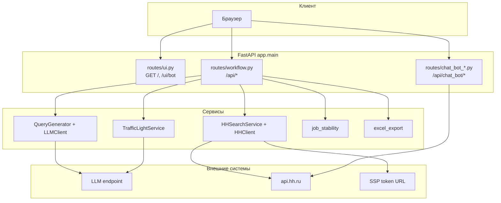
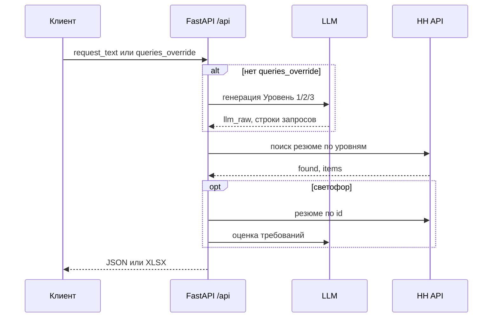

# HH Optimizer (FastAPI)

Сервис для подбора кандидатов в HH с двумя сценариями:

1. Классический поиск: из текста вакансии строит 3 уровня булевых запросов, запускает поиск в HH и отображает кандидатов.
2. Светофор: дополнительно оценивает релевантность кандидатов через LLM и возвращает цвет/процент совпадения.
3. HH Chat Bot: автоматизация переписки с кандидатами через HH chat API (webhook + polling fallback).

---

## Документация: workflow, архитектура, интерфейс, API, тесты

| Тема | Где подробнее |
|------|----------------|
| Пайплайн «булевы → HH → светофор» | раздел **Workflow (логика)** ниже, §2 «Как это работает», §5 контракты |
| Архитектура модулей | диаграмма ниже, §6 «Ключевые модули» |
| Веб-интерфейс | §**Интерфейс**, §8 запуск, §9 сценарии |
| REST API | §4 маршруты, **`openapi.yaml`**, `/docs` |
| Автотесты | §**Тесты** |

### Архитектура (визуально)

Сервис собран как один FastAPI-приложение с отдельными роутерами: UI (HTML/JS в ответах), workflow (`/api`), чат-бот (`/api/chat_bot`). Данные для поиска идут через LLM-клиент и HH-клиент; результаты поиска могут писаться в SQLite (`log_store`).



### Workflow (логика)

Типичный сценарий без браузера: сначала получить булевы запросы (`POST /api/generate_queries` или сразу передать `queries_override`), затем выполнить поиск (`POST /api/search`). Опционально — оценка «светофор» по top-X (`POST /api/svetofor`) и выгрузка Excel (`POST /api/export_excel` или `include_excel` в JSON).



### Интерфейс

| URL | Назначение |
|-----|------------|
| `GET /` | Основной UI: текст вакансии, генерация булевых запросов, поиск HH, таблица кандидатов, светофор, экспорт. |
| `GET /ui/bot` | UI чат-бота: подписки webhook, создание чата, polling, журнал событий. |

Оба интерфейса работают поверх тех же API, что описаны для машинных клиентов; см. §9 пользовательские сценарии.

### API и OpenAPI

- Интерактивная схема приложения: **`/docs`** (Swagger UI), также **`GET /openapi.json`** — схема только **этого** сервиса.
- Файл **[`openapi.yaml`](openapi.yaml)** в репозитории — **один файл**, внутри **два YAML-документа**, разделённых строкой `---`:
  1. **HH Optimizer API** — эндпоинты FastAPI (`/api/...`, часть описаний чат-бота и т.д.), то же по смыслу, что `/openapi.json`.
  2. **HeadHunter API** — полная официальная спецификация `https://api.hh.ru` (справочник полей и путей HH). Нужна, чтобы сопоставлять ответы HH с описанием схем при разработке и отладке.

Просмотрщики OpenAPI, которые читают только первый документ, по-прежнему корректно показывают API сервиса; второй документ удобно открывать в IDE или в отдельной вкладке Redoc/Swagger как справочник HH.

### Тесты

Запуск всех юнит-тестов из корня репозитория:

```bash
pytest tests/
```

Конфигурация: [`pytest.ini`](pytest.ini) (`pythonpath = .`). Покрытие включает: валидацию Pydantic-схем, `job_stability`, `HHSearchService`, `LLMClient`, генератор запросов, экспорт Excel, хелперы `workflow`, HTTP-эндпоинты workflow с подменой `HHSearchService` / async-светофора, UI-маршруты `GET /` и `GET /ui/bot`, чат-бот (сервис и API с моками), `SqliteLogStore`, `SqliteChatBotStore`, целостность объединённого `openapi.yaml`, существующие тесты светофора в `test_traffic_light_service.py`.

---

## 1. Возможности

- Генерация 3 уровней boolean-запросов через LLM (`Уровень 1/2/3`).
- Автоматическое добавление anti-manager исключения в запросы.
- Поиск резюме в HH API по фильтрам региона, ролей и опыта.
- Нормализация карточек кандидатов в стабильный JSON для UI.
- "Светофор" по кандидатам (цвет, match %, комментарий, debug).
- Фильтры "прыгун/не в деле" перед светофором.
- Локальный UI для рекрутингового workflow и отдельный UI чат-бота.
- SQLite-хранилище результатов HH поиска и событий чат-бота.

---

## 2. Как это работает (кратко)

Вход: `request_text` (требования вакансии)  
Выход: сформированные булевы запросы, найденные кандидаты, счетчики по уровням, а при светофоре - ранжированный список.

Pipeline:

1. API получает `request_text`.
2. `QueryGenerator` собирает prompt и вызывает LLM.
3. `LLMClient.extract_queries()` вытаскивает 3 уровня запроса.
4. `HHSearchService` добавляет исключения и собирает HH фильтры.
5. `HHClient` запрашивает `https://api.hh.ru/resumes`, при `401` делает повтор с обновленным токеном.
6. Результаты нормализуются и отдаются в API-ответ.
7. Для `/api/svetofor` по top-X кандидатам дополнительно выполняются HH resume fetch + LLM оценка в параллели.

---

## 3. Структура проекта

```text
app/
  main.py
  api/
    router.py
    routes/
      ui.py
      workflow.py
      chat_bot_ui.py
      chat_bot_api.py
  clients/
    llm_client.py
    hh_client.py
    hh_chat_client.py
  core/
    settings.py
    logging.py
    log_store.py
    chat_bot_store.py
  models/
    schemas.py
  services/
    prompts.py
    query_generator.py
    hh_search.py
    traffic_light_service.py
    job_stability.py
    chat_bot_service.py
  utils/
    file_manager.py

txt/
  request.txt
  system_prompt.txt
  user_prompt.txt

hh_optimizer.sqlite
hh_chat_bot.sqlite
```

---

## 4. API маршруты

Машиночитаемая спецификация сервиса: файл [`openapi.yaml`](openapi.yaml) — **первый** YAML-документ внутри файла (OpenAPI 3); второй документ в том же файле — справочник HeadHunter API (см. раздел **«API и OpenAPI»** выше). Автогенерируемая схема приложения — в Swagger UI (`/docs`) и `GET /openapi.json` (только FastAPI, без второго документа).

### UI маршруты

- `GET /` — основной UI поиска/светофора.
- `GET /ui/bot` — UI чат-бота.

### Workflow API (`/api`) — полный сценарий без браузера

Цепочка по смыслу: **булевы запросы** → **поиск HH** → **светофор** (опционально). Эндпоинты можно вызывать по отдельности или комбинировать.

| Метод | Путь | Назначение |
|--------|------|------------|
| `GET` | `/api/default_request` | Текст «запроса по умолчанию» из `txt/request.txt` |
| `GET` | `/api/system_prompt` | Текст системного промпта для генерации булевых запросов |
| `GET` | `/api/user_prompt` | Шаблон пользовательского промпта (с плейсхолдером под вакансию) |
| `POST` | `/api/generate_queries` | Только этап LLM: три булевых уровня (или подстановка готовых `queries_override`) |
| `POST` | `/api/search` | Булевы запросы + поиск в HH; опционально Excel в JSON (`include_excel`) |
| `POST` | `/api/svetofor` | Как поиск + оценка «светофор» по первым `svetofor_top_x` кандидатов; опционально Excel в JSON |
| `POST` | `/api/export_excel` | Тот же пайплайн, ответ — **бинарный** `.xlsx` (скачивание файла), не JSON |

**Передача булевых запросов без LLM:** в теле `POST /api/search`, `/api/svetofor`, `/api/export_excel` и опционально `/api/generate_queries` укажите `queries_override` — объект с ключами `Уровень 1`, `Уровень 2`, `Уровень 3`. Тогда вызов LLM для генерации булевых строк **не выполняется**, `llm_raw` в ответе будет `null`. Поле `request_text` в этом режиме может быть пустым строкой, но для контекста HH (фильтры, светофор) обычно имеет смысл передать текст вакансии.

**Excel в JSON:** у `POST /api/search` и `POST /api/svetofor` установите `include_excel: true`. В ответ добавятся `excel_base64` и `excel_filename` (книга в памяти, закодированная в Base64). По умолчанию `include_excel: false` — только JSON.

**Скачать Excel отдельно:** `POST /api/export_excel` с тем же телом, что и поиск (включая `include_traffic_light`, `svetofor_top_x`, `traffic_light_candidates_for_excel` при необходимости). Ответ — поток `application/vnd.openxmlformats-officedocument.spreadsheetml.sheet`.

### Chat Bot API (`/api/chat_bot`)

- `POST /api/chat_bot/webhook/subscription/create`
- `GET /api/chat_bot/webhook/subscription/list`
- `POST /api/chat_bot/webhook/subscription/cancel`
- `POST /api/chat_bot/chat/create`
- `POST /api/chat_bot/chat/send`
- `POST /api/chat_bot/poller/start`
- `POST /api/chat_bot/poller/stop`
- `POST /api/chat_bot/poller/once`
- `GET /api/chat_bot/state`
- `GET /api/chat_bot/events`
- `POST /api/chat_bot/webhook`

Подробные тела запросов/ответов — в [`openapi.yaml`](openapi.yaml).

---

## 5. Контракты workflow: тело `SearchRequest` (общее для search / svetofor / export_excel)

Типы и ограничения заданы в `app/models/schemas.py`. Ниже — смысл полей.

### Обязательные условия

- Если **`queries_override` не задан**, поле **`request_text`** должно содержать непустой текст (после trim) — иначе валидация вернёт ошибку.
- Если задан **`queries_override`**, **`request_text`** может быть пустым.

### Поля запроса

| Поле | Обяз. | По умолчанию | Описание |
|------|--------|----------------|----------|
| `request_text` | Условно* | `""` | Текст вакансии / требований; для LLM, HH и светофора |
| `queries_override` | нет | `null` | Готовые булевы строки по трём уровням — без вызова LLM |
| `selected_level` | нет | `Уровень 2` | Уровень для отображения/отбора в поиске |
| `candidates_limit` | нет | `20` | Сколько резюме на уровень запрашивать у HH (1–200) |
| `area_id` | нет | из env | Регион HH |
| `professional_roles` | нет | из env | Список id проф. ролей HH |
| `system_prompt_override` | нет | `null` | Замена системного промпта при генерации булевых запросов |
| `user_prompt_override` | нет | `null` | Замена шаблона пользовательского промпта (`{vac_reqs}`) |
| `include_excel` | нет | `false` | Только для **`/api/search`** и **`/api/svetofor`**: добавить в JSON `excel_base64` + `excel_filename` |
| `min_stay_months` | нет | `3` | Мин. срок на одном месте (мес), фильтр перед светофором |
| `allowed_short_jobs` | нет | `2` | Сколько «коротких» мест допустимо (см. режим прыгуна) |
| `jump_mode` | нет | `consecutive` | `consecutive` — подряд идущие короткие места; `total` — суммарно коротких |
| `max_not_employed_months` | нет | `6` | Макс. «не в деле» с конца последней работы (мес) |
| `svetofor_top_x` | нет | `20` | Первые X кандидатов выбранного уровня для светофора / Excel со светофором |
| `include_traffic_light` | нет | `false` | Для **`/api/export_excel`**: пересчитать светофор и заполнить лист «Светофор» |
| `traffic_light_candidates_for_excel` | нет | `null` | Готовые объекты светофора из UI — без повторного LLM при экспорте |

\* Обязательно, если нет `queries_override`.

### Ответ `POST /api/search` (`SearchResponse`)

| Поле | Тип | Описание |
|------|-----|----------|
| `llm_raw` | any \| null | Сырой ответ LLM при генерации булевых; `null` при `queries_override` |
| `queries` | object | Три уровня булевых строк |
| `queries_with_exclusions` | object | Запросы с доп. исключениями (как уходит в HH) |
| `found_counts` | object | Число найденных по уровням |
| `selected_level` | string | Выбранный уровень |
| `token_source_used` | string | Источник токена HH (`ssp`) |
| `candidates_by_level` | object | Нормализованные кандидаты по уровням |
| `excel_base64` | string \| null | Если `include_excel: true` |
| `excel_filename` | string \| null | Имя файла для сохранения |

### Ответ `POST /api/svetofor` (`SvetoforResponse`)

Все поля как у поиска, плюс:

| Поле | Описание |
|------|----------|
| `traffic_light_candidates` | Список кандидатов с оценкой, требованиями и `color_score_percent` |
| `excel_base64`, `excel_filename` | При `include_excel: true` |

### `POST /api/generate_queries` (`GenerateQueriesRequest` / `GenerateQueriesResponse`)

**Вход:** `request_text` (обязателен, если нет `queries_override`), `system_prompt_override`, `user_prompt_override`, опционально `queries_override`.

**Выход:** `llm_raw`, `queries`.

### Примеры

**1) Только JSON, поиск с генерацией булевых запросов**

```http
POST /api/search HTTP/1.1
Content-Type: application/json

{
  "request_text": "Python backend, Django, 3+ года",
  "candidates_limit": 20,
  "include_excel": false
}
```

Фрагмент ответа (сокращённо):

```json
{
  "llm_raw": { "...": "..." },
  "queries": {
    "Уровень 1": "...",
    "Уровень 2": "...",
    "Уровень 3": "..."
  },
  "found_counts": { "Уровень 1": 0, "Уровень 2": 12, "Уровень 3": 3 },
  "selected_level": "Уровень 2",
  "candidates_by_level": { "Уровень 2": [ { "id": "...", "title": "..." } ] }
}
```

**2) Поиск с готовыми булевыми запросами и Excel в JSON**

```json
{
  "request_text": "Описание для светофора и HH",
  "queries_override": {
    "Уровень 1": "NOT (head OR lead) AND python",
    "Уровень 2": "python AND django",
    "Уровень 3": "python django postgres"
  },
  "include_excel": true,
  "candidates_limit": 20
}
```

В ответе помимо полей поиска появятся `excel_base64` и `excel_filename`.

**3) Светофор с параметрами «как в UI»**

```json
{
  "request_text": "...",
  "candidates_limit": 20,
  "svetofor_top_x": 20,
  "min_stay_months": 3,
  "allowed_short_jobs": 2,
  "jump_mode": "consecutive",
  "max_not_employed_months": 6,
  "include_excel": false
}
```

---

## 6. Ключевые модули и ответственность

- `app/services/query_generator.py` - сбор prompt и генерация 3 уровней.
- `app/clients/llm_client.py` - вызов LLM и resilient-парсинг ответа.
- `app/services/hh_search.py` - фильтры HH, anti-manager исключения, orchestration поиска.
- `app/clients/hh_client.py` - работа с HH resumes API, токен, retry, сохранение результата.
- `app/services/traffic_light_service.py` - светофор-анализ кандидата.
- `app/services/job_stability.py` - фильтрация по стажу/перерывам/прыжкам.
- `app/services/chat_bot_service.py` - бизнес-логика чат-бота (создание/состояние/ответы).
- `app/core/log_store.py` - хранение результатов HH поиска в SQLite.
- `app/core/chat_bot_store.py` - состояния и события чат-бота в SQLite.

---

## 7. Конфигурация окружения

Пример (`.env.example`):

```env
LOG_LEVEL=INFO
LLM_URL=http://int-srv:8085/metrics/ecm/gpt
LLM_TOKEN_PARAM=?token=DebugEcmTest
HH_TOKEN_URL=http://int-srv:8085/metrics/hh/accessToken
AREA_ID=113
PROFESSIONAL_ROLES=96,113
USE_MOCK_LLM=false
USE_MOCK_HH=false
```

Ключевые переменные:

- `LLM_URL` - endpoint LLM.
- `LLM_TOKEN_PARAM` - auth/query-параметр для LLM.
- `HH_TOKEN_URL` - внутренний endpoint, который отдает HH access token.
- `AREA_ID` - регион поиска по умолчанию.
- `PROFESSIONAL_ROLES` - CSV ролей HH по умолчанию.
- `LOG_LEVEL` - уровень логирования.

---

## 8. Локальный запуск

Требования:
- Python 3.11+ (рекомендуется).
- Доступ к внутренним endpoint для LLM и HH token.

Шаги:

```bash
python -m venv .venv
.venv\Scripts\activate
pip install -r requirements.txt
uvicorn app.main:app --reload
```

После старта:

- UI поиска: `http://127.0.0.1:8000/`
- UI чат-бота: `http://127.0.0.1:8000/ui/bot`
- Swagger: `http://127.0.0.1:8000/docs`

---

## 9. Пользовательские сценарии

### Сценарий A: Быстрый подбор кандидатов

1. Открыть `/`.
2. Вставить требования вакансии.
3. Нажать "Получить булевый запрос" или сразу "Поиск".
4. Проверить выдачу по уровням и таблицу кандидатов.

### Сценарий B: Светофор

1. Выполнить поиск.
2. Нажать "Светофор".
3. Сервис отберет top-X кандидатов, применит фильтры стажа/перерывов и оценит релевантность через LLM.
4. Проверить цвета/проценты и детализацию.

### Сценарий C: Автоответчик HH Chat

1. Открыть `/ui/bot`.
2. Создать webhook-подписку.
3. Создать/получить чат по resume hash/url.
4. Настроить prompts и polling.
5. Проверять события в разделе лога.

---

## 10. Хранение данных

- `hh_optimizer.sqlite`:
  - таблица `hh_search_runs` с компактными результатами HH поиска.
- `hh_chat_bot.sqlite`:
  - состояния чатов, настройки polling, журнал событий чат-бота.

Преимущество: нет зависимости от JSON-файлов для основных runtime-данных.

---

## 11. Диагностика и типовые проблемы

### Пустые `queries` в ответе

- Проверьте `llm_raw` - в нем обычно есть причина некорректного формата ответа LLM.
- Проверьте корректность `system_prompt` и `user_prompt`.
- Убедитесь в доступности `LLM_URL`.

### 401 от HH API

- Сервис делает retry с повторным получением токена автоматически.
- Если проблема сохраняется, проверьте доступность `HH_TOKEN_URL`.

### Нет кандидатов в светофоре

- Возможно, кандидаты отфильтрованы логикой job stability.
- Проверьте значения `min_stay_months`, `allowed_short_jobs`, `jump_mode`, `max_not_employed_months`.
- Увеличьте `svetofor_top_x` в разумных пределах.

### В Excel в таймингах отображаются нули

- В листе `Запрос` длительности этапов теперь пишутся с точностью до миллисекунд (например, `0.437 s`), поэтому быстрые этапы больше не округляются до `0 min 0 s`.
- Для `POST /api/export_excel_ui` UI передаёт серверные метки времени предыдущих этапов (`started_at`, `bool_finished_at`, `hh_finished_at`, `finished_at`, `ran_traffic_light`), поэтому в книге тоже заполняются реальные длительности.
- Строка `Время построения Светофора` выводится только если светофор реально запускался (`ran_traffic_light=true`); иначе строка не добавляется.
- Сервис пишет дополнительный timing breakdown в логи (`excel_export.build_search_excel_bytes.timing_breakdown`) и отдельный сигнал при аномальном порядке меток времени (`...timing_anomaly`).

### Чат-бот не отвечает

- Проверьте наличие `chat_id` в state.
- Проверьте, что webhook подписка активна.
- Для fallback убедитесь, что включен polling.

---

## 12. Развертывание

В репозитории есть:

- `Procfile` для запуска через `uvicorn`.
- `render.yaml` с конфигурацией сервиса на Render.

Перед продом проверьте:

- корректность env-переменных;
- доступность внутренних интеграций;
- лимиты и таймауты на внешние вызовы.

---

## 13. Roadmap (что обычно развивают дальше)

- Прогресс-бар этапов поиска в UI.
- Улучшение observability (метрики этапов, latency breakdown).
- Интеграционные/E2E тесты с поднятым mock-сервером LLM/HH (юнит-тесты в `tests/` уже покрывают основные модули).
- Расширение правил ранжирования кандидатов под конкретные домены.

---

## 14. Короткий FAQ

**Где менять prompts для генерации запросов?**  
В `txt/system_prompt.txt` и `txt/user_prompt.txt`, либо через override в UI/API.

**Где менять фильтры HH по умолчанию?**  
В `app/services/hh_search.py` и переменных `AREA_ID`, `PROFESSIONAL_ROLES`.

**Где смотреть логи/диагностику по генерации?**  
Смотрите `llm_raw` в API ответах и application logs.

**Где смотреть события чат-бота?**  
Через `GET /api/chat_bot/events` и UI `/ui/bot`.

